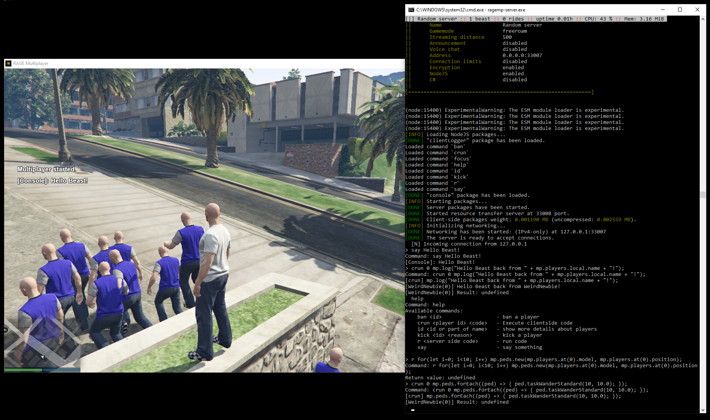

# Base
Base is a set of resources and tools with active server console for debugging Rage Multiplayer NodeJS server projects.

This resource is created and maintained by the [Project Unknown](https://discord.gg/3sqHSzy) team and requires [RAGE Multiplayer v1.1](https://rage.mp/).

## Features:
- Server
   - Console prompt with commands and permanent history (requires 'readline')
   - Customizable console status bar displaying uptime, load and more info
   - Dynamic command system (check [packages/server_console/commands/README.md](packages/server_console/commands/README.md) for more info)
   - Execute server side NodeJS code from console prompt (`r <code>`)
   - Execute client side JavaScript code from console prompt (`crun <user id> <code>`)

- Client
   - Clientside debug command `mp.log(text)` to log and filter duplicate messages like render errors as example

# Modules
## server_console


## client_debugging
Clientside debug utility merging duplicate messages saving nerves.

Usage clientside:
```JS
mp.log("Hello beast!");
```

Output on server console:
```
[WeirdNewbie(0)] Hello beast!
```

## Example for merged duplicate messages:


Usage clientside:
```JS
let func=() => {
   mp.log("test");
};

mp.events.add("render", func);
setTimeout(() => { mp.events.remove("render", func); }, 10000);
```

Output on server console:
```
[WeirdNewbie(0)] test [ 185 x DUP ]
[WeirdNewbie(0)] test [ 185 x DUP ]
[WeirdNewbie(0)] test [ 185 x DUP ]
[WeirdNewbie(0)] test [ 59 x DUP ]
```
