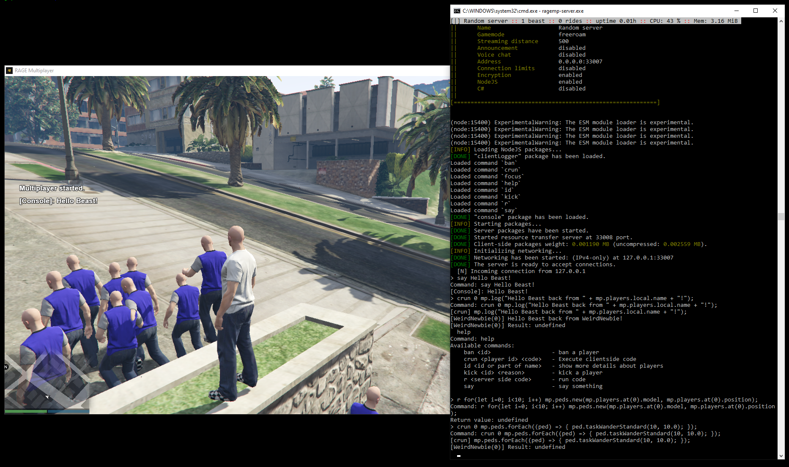
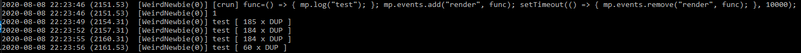

# Base

Base is a resource bundle for RAGE Multiplayer NodeJS servers, focused on practical debugging and runtime observability.

This resource is created and maintained by the [Project Unknown](https://discord.gg/3sqHSzy) team and requires [RAGE Multiplayer v1.1](https://rage.mp/).

## Overview

Base includes two main modules:

- `server_console`: interactive server console UI (blessed-based), command runtime, and persistent history/config.
- `client_debug`: client-side logging bridge with duplicate merge support.

The goal is simple: faster issue diagnosis during development and live server operation.

## Features

### Server Console

- Blessed-based interactive terminal UI with status/title row and scrollable log viewport
- Dynamic command loading from JavaScript files
- Persistent command history in `console_history.json`
- Persistent console configuration in `console_config.json`
- Server-side code execution from prompt via `r <code>`
- Client-side code execution from prompt via `crun <player id> <code>`

### Client Debugging

- Client command `mp.log(text)` forwards messages to the server console
- Duplicate messages are merged to reduce spam during frequent events (for example render loops)

## Quick Start

```bash
npm install
npm start
```

## Command Development (Important)

Custom commands for the Base resource must be placed in:

- `packages/server_console/commands`

Do not place Base command extensions in:

- `packages/server_console/tty/commands`

The `tty/commands` folder only contains default command files from the tty submodule and is not the intended extension location for Base resource command development.

For command module format and handler API, read:

- [packages/server_console/commands/README.md](packages/server_console/commands/README.md)

## Console Usage Examples

Evaluate server-side code:

```text
r mp.players.length
```

Execute client-side code for a specific player id:

```text
crun 0 mp.log("hello from client")
```

Open available commands:

```text
help
```

## Client Logging Examples

Simple client-side log:

```js
mp.log("Hello beast!");
```

Output in server console:

```text
[WeirdNewbie(0)] Hello beast!
```

Duplicate merge example:

```js
const func = () => {
  mp.log("test");
};

mp.events.add("render", func);
setTimeout(() => {
  mp.events.remove("render", func);
}, 10000);
```

Example output:

```text
[WeirdNewbie(0)] test [ 185 x DUP ]
[WeirdNewbie(0)] test [ 185 x DUP ]
[WeirdNewbie(0)] test [ 185 x DUP ]
[WeirdNewbie(0)] test [ 59 x DUP ]
```

## Modules

### server_console



### client_debug



## Further Reading

For detailed tty runtime behavior, embedding modes, advanced controls, and low-level console internals, read:

- [packages/server_console/tty/README.md](packages/server_console/tty/README.md)
